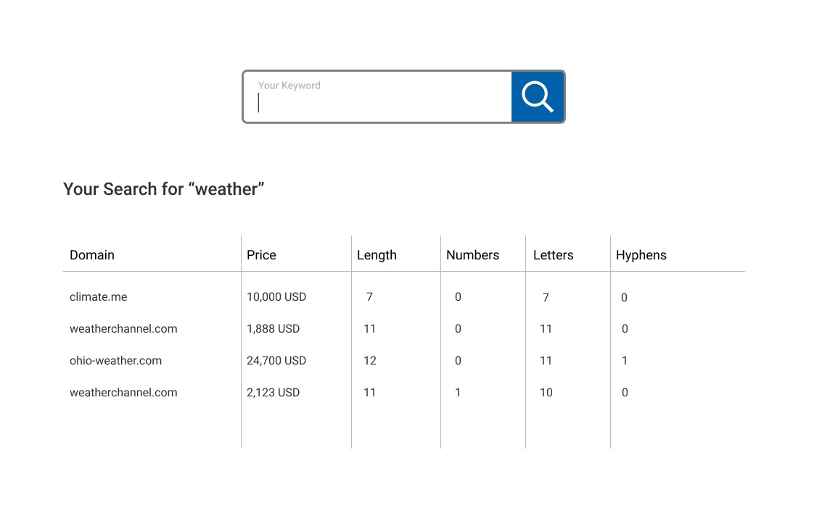

# Introduction

We are happy that you are interested in taking part in our **Java developing case study** and thank you for taking the time!

The case study should not take you longer than **4 hours**. Please push your developed code back to this repository shortly after the time is up. It does not matter if you were unable to complete the task in this timeframe. We would like to get an impression of your thoughts and solutions as best as possible.

1.	Please do not hesitate to ask if you have any questions regarding your task!
2.	You can use any kind of internet research and any site and frameworks/tools you want.


# Your task

## Fictitious starting point

You are a new member of the Sedo development Scrum team. The product owner wants to offer our users a new tool. It is intended to evaluate the value of [domain names](https://en.wikipedia.org/wiki/Domain_name). According to his definition:
- "The domain name value can be calculated by certain character analyzes!"

Based on design mockups, the frontend developer has already started with the development of the web interface which contains a form field to enter a keyword and shows a result list.




## Development

Develop a Java REST web service application to deliver the analyzed results to the frontend. This application should accept at least the 'keyword' parameter. The frontend development is not part of your task!


1.  Your application should accept the request parameter "keyword". It uses the parameter to query the official Sedo Search API (example see below) to receive a list of domain names and prices related to the keyword. The Sedo Search API will return its response as a JSON object. Below, you will find a `curl` example for testing.

2.  Analyze the following metrics for each domain name from the response:

    * [ ] ignore domains without a price value
    * [ ] count the domain name length
    (without the TLD, e.g. for sedo.com count only sedo)
    * [ ] count the amount of numbers, letters and hyphen characters contained in the domain name
    (without the TLD (e.g. for seven-one-360.com: 3 numbers, 8 letters, 2 hyphen))

3.  Your application should return a response containing your metrics in relation to the respective domain name.

4.  In case you have any time left, please store the metrics in relation to the respective domain name into a database of your choice.

### How to query the Sedo Search API:

```
curl -XPOST "https://sedo.com/service/common.php" \
--data "keyword=weather&page=1&rel=6&orderdirection=2&domainIds=&v=0.1&o=json&m=search&f=requestSearch&pagesize=50"
```

## Bonus task

Provide a `Dockerfile` and maybe `docker-compose.yaml` so your application can be built and run within a Docker container.


# Evaluation 

We evaluate your development according to the following criteria

-  Code quality
-  Framework selection
-  Testability and maintainability


---

> We wish you good luck!